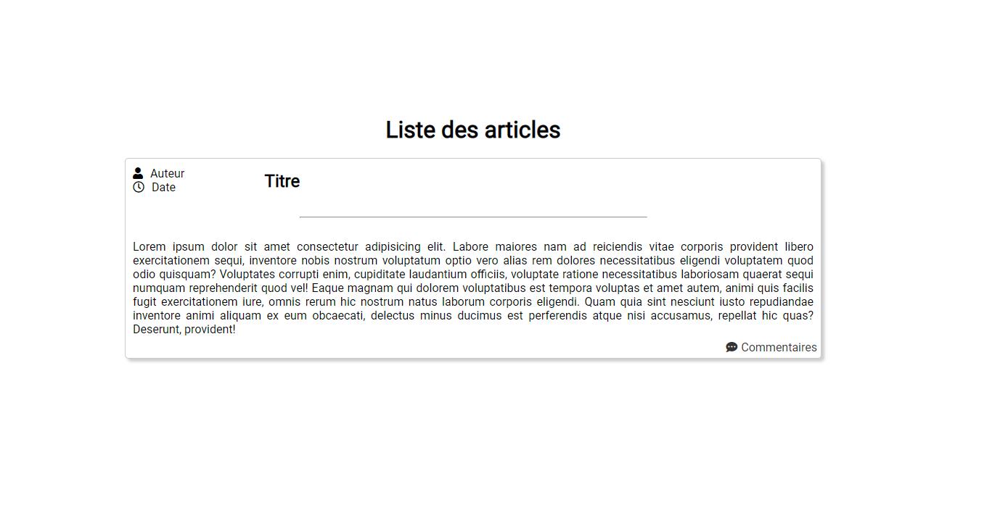

# 1ère version du blog

Affichage des articles et des commentaires

## Base de données

Une table articles et une table commentaires


❔ Ajouter une propriété "résumé" dans la table articles.

## Structure du site

1 page index.php qui contient les articles.

❔ Au lieu d'afficher l'article en entier, afficher juste le résumé.

1 page commentaires qui contient les commentaires. ❔ Renommer cette page "article"

❔ L'article sera affiché entièrement dans cette page, avec les commentaires au-dessous.

## index.php



### HTML

```html
<h1>Liste des articles</h1>

<div class="article">
    <div class="articleHeader">
        <div class="articleInfos">
            <p><i class="fas fa-user"></i>Auteur</p>
            <p><i class="far fa-clock"></i>Date</p>
        </div>
        <div class="articleTitre">
            <h2>Titre</h2>
        </div>
    </div>
    <hr>
    <div class="articleContent">
        <p>Lorem ipsum dolor sit amet consectetur adipisicing elit. Labore maiores nam ad reiciendis vitae corporis provident libero exercitationem sequi, inventore nobinostrum voluptatum optio vero alias rem dolores necessitatibus eligendi voluptatem quod odio quisquam? Voluptates corrupti enim, cupiditate laudantium officiisvoluptate ratione necessitatibus laboriosam quaerat sequi numquam reprehenderit quod vel! Eaque magnam qui dolorem voluptatibus est tempora voluptas et amet autemanimi quis facilis fugit exercitationem iure, omnis rerum hic nostrum natus laborum corporis eligendi. Quam quia sint nesciunt iusto repudiandae inventore animi aliquaex eum obcaecati, delectus minus ducimus est perferendis atque nisi accusamus, repellat hic quas? Deserunt, provident!</p>
        <a class="comments" href="#"><p><i class="fas fa-comment-dots"></i>Commentaires</p></a>
    </div>
</div>
```

### CSS
```css
.article {
    width: 100%;
    height: auto;

    

    border: 1px solid #ccc;
    border-radius: 5px;
    box-shadow: 4px 4px 4px #ccc;
    margin: 20px;
}

.articleHeader {
    width: 100%;
    height: 60px;

    display: flex;
    justify-content: space-between;
    align-items: center;

    /* border: 1px solid cyan; */
}

.articleInfos {
    width: 20%;
    height: 100%;

    display: flex;
    flex-direction: column;
    justify-content: center;
    align-items: flex-start;

    /* border: 1px solid #000; */
}

.articleInfos>p>i {
    margin-right: 10px;
}

.articleInfos>p {
    margin-left: 10px;
}

.articleTitre {
    width: 80%;
    height: 100%;

    display: flex;
    justify-content: flex-start;
    align-items: center;

    /* border: 1px solid #000; */
}

.article>hr {
    width: 50%;
    margin: 20px auto;
}

.articleContent {
    position: relative;

    width: 100%;
    height: auto;

    padding: 10px 10px 30px 10px;
    /* border: 1px solid #000; */
    text-align: justify;
}

.comments {
    position: absolute;
    bottom: 5px;
    right: 5px;
    text-decoration: none;
    color: #333;
}

.comments>p>i {
    margin-right: 5px;
}
```