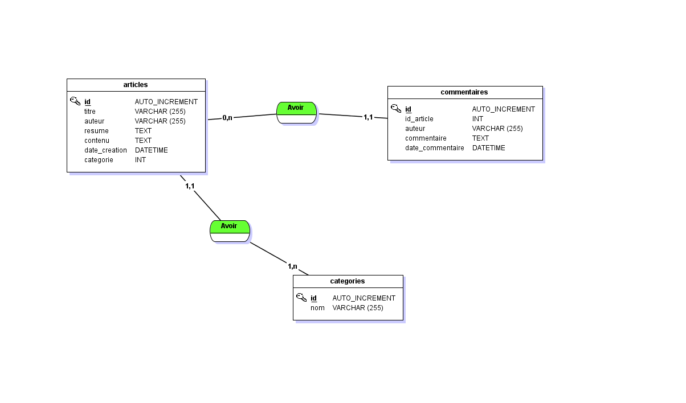

# 2ème version du Blog

Page d'accueil avec affichage des 5 derniers articles,

Page Article avec affichage de l'article sélectionné et ses commentaires,

Formulaire pour ajouter un commentaire,

Page Articles pour afficher tous les articles classés par catégories.

## Base de données



## Fonctions PHP

Connexion base de données (connexionDB.php)
```php
// Connexion à la base de données
try {
    $db = new PDO("mysql:host=localhost;dbname=blog;charset=utf8", "root", "");
} catch (PDOException $erreur) {
    echo "Problème à la connexion : " . $erreur->getMessage();
}
```
Afficher les 5 derniers articles (requeteDerniersArticles.php)
```php
// Requête SQL pour afficher les 5 derniers articles
$req = $db->query(
    "SELECT a.id AS id_article, a.titre AS titre_article, a.auteur AS auteur_article, DATE_FORMAT(a.date_creation, 'Le %d/%m/%Y à %Hh%i') AS date_creation_fr, a.categorie AS categorie_article, c.id AS id_categorie 
    FROM articles AS a
    LEFT JOIN categories AS c
    ON c.id = a.categorie
    ORDER BY date_creation 
    DESC LIMIT 0,5"
);
```
Afficher 1 article (requeteArticle.php)
```php
// Afficher l'article
$requeteArticle = $db->prepare(
    "SELECT a.id AS id_article, a.titre AS titre_article, a.auteur AS auteur_article, a.contenu AS article_contenu, DATE_FORMAT(a.date_creation, 'Le %d/%m/%Y à %Hh%i') ASdate_creation_fr, a.categorie AS categorie_article 
    FROM articles AS a 
    WHERE id = ?"
);
$requeteArticle->execute(array($_GET['id']));
```
Afficher les commentaires (requeteCommentaires.php)
```php
// Afficher les commentaires
$requeteCommentaires = $db->prepare(
    "SELECT id, id_article, auteur, commentaire, DATE_FORMAT(date_commentaire, 'Le %d/%m/%Y à %Hh%i') AS date_commentaire_fr FROM commentaires WHERE id_article = ? ORDER BY date_commentaire DESC"
);
$requeteCommentaires->execute(array($_GET['id']));
```
Ajouter un commentaire dans la base de données (commentaire_post.php)
```php
// Entrer les données dans la base
$req = $db->prepare("INSERT INTO commentaires (id_article, auteur, commentaire, date_commentaire) VALUES(?, ?, ?, NOW())");
$req->execute(array($_GET['id'], $_POST['pseudo'], $_POST['commentaire']));

// Redirection vers la page Article
header('Location: afficherArticle.php?id=' . $_GET["id"] . '#lesCommentaires');
```