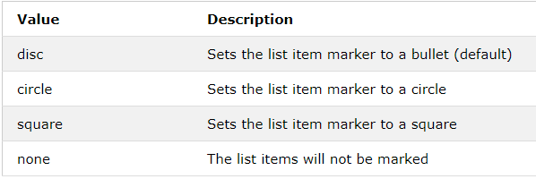

# Règles CSS

## Changer le comportement des liens
```css
a:link {
  color: green;
  background-color: transparent;
  text-decoration: none;
}

a:visited {
  color: pink;
  background-color: transparent;
  text-decoration: none;
}

a:hover {
  color: red;
  background-color: transparent;
  text-decoration: underline;
}

a:active {
  color: yellow;
  background-color: transparent;
  text-decoration: underline;
}
```

## Listes

Propriété ```list-style-type```



Créer une liste horizontale
```html
<ul>
  <li><a href="#home">Home</a></li>
  <li><a href="#news">News</a></li>
  <li><a href="#contact">Contact</a></li>
  <li><a href="#about">About</a></li>
</ul>
```
```css
ul {
  list-style-type: none;
  margin: 0;
  padding: 0;
  overflow: hidden;
  background-color: #333333;
}

li {
  float: left;
}

li a {
  display: block;
  color: white;
  text-align: center;
  padding: 16px;
  text-decoration: none;
}

li a:hover {
  background-color: #111111;
}
```