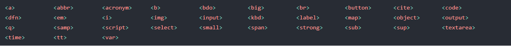
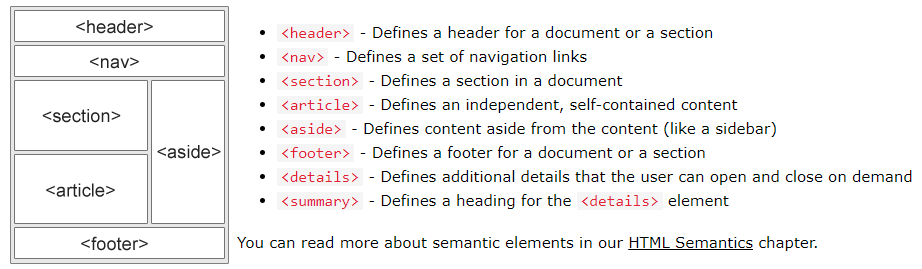

# Balises et attributs

## Attribut "title"
```html
<p title="un titre">
```
Affiche un tooltip quand on passe la souris dessus.

## Balise \<pre>
```html
<pre>
    Première ligne

    Deuxième ligne
    Troisième ligne
</pre>
```
Cette balise sert à afficher son contenu tel qu'il est presenté dans l'éditeur de code / texte.

## Balises \<sub> et \<sup>
```html
<p>This is <sub>subscript</sub> and <sup>superscript</sup></p>
```


## Balises pour formater des éléments :


## Attributs "target" pour les liens


## Attribut "mailto"

Cliquer sur le lien permet d'envoyer un mail

```html
<a href="mailto:yannickbiheul@outlook.fr">Envoyer mail</a>
```

## Balise \<map>

Permet de mapper une image pour insérer des liens à différents endroits.
```html


<map name="workmap">
  <area shape="rect" coords="34,44,270,350" alt="Computer" href="computer.htm">
  <area shape="rect" coords="290,172,333,250" alt="Phone" href="phone.htm">
  <area shape="circle" coords="337,300,44" alt="Coffee" href="coffee.htm">
</map>
```
Plus d'infos : [w3schools](https://www.w3schools.com/html/html_images_imagemap.asp)

## Balise \<picture>
```html
<picture>
  <source media="(min-width: 650px)" srcset="img_food.jpg">
  <source media="(min-width: 465px)" srcset="img_car.jpg">
  
</picture>
```
Plus d'infos : [w3schools](https://www.w3schools.com/html/html_images_picture.asp)

## Balises Liste Description

Comme \<ul> et \<li>, mais avec une description.
```html
<dl>
  <dt>Coffee</dt>
  <dd>- black hot drink</dd>
  <dt>Milk</dt>
  <dd>- white cold drink</dd>
</dl>
```

## Attributs Liste Ordonnée


Contrôler le 1er numéro de l'index :
```html
<ol start="50">
  <li>Coffee</li>
  <li>Tea</li>
  <li>Milk</li>
</ol>
```

## Éléments block :


Un élément block commence toujours sur une nouvelle ligne,

il occupe toute la largeur de la page,

il a des margin-top et margin-bottom.

## Éléments inline :


Un élément inline ne commence pas sur une nouvelle ligne,

il occupe juste la largeur nécessaire.

## Balise \<iframe>

Un iframe peut être utilisé comme cible sur un lien.
```html
<iframe src="demo_iframe.htm" name="iframe_a" title="Iframe Example"></iframe>

<p><a href="https://www.w3schools.com" target="iframe_a">W3Schools.com</a></p>
```
Le site ciblé avec le lien s'ouvrira dans l'iframe.

## Balise \<noscript>

Cette balise sert à afficher des trucs aux gens qui ont désactivé javaScript, par exemple.
```html
<noscript>Sorry, your browser does not support JavaScript!</noscript>
```

## Attribut "http-equiv"

Dans une balise \<meta>, sert à rafraichir la page toutes les n secondes (définies dans l'attribut "content").
```html
<meta http-equiv="refresh" content="30">
```

## Balise \<base>

Sert à spécifier une adresse URL de base dans une page web.

Plus d'infos : [w3schools](https://www.w3schools.com/tags/tag_base.asp)

## Éléments sémantiques


Plus d'infos : [w3schools](https://www.w3schools.com/html/html5_semantic_elements.asp)
